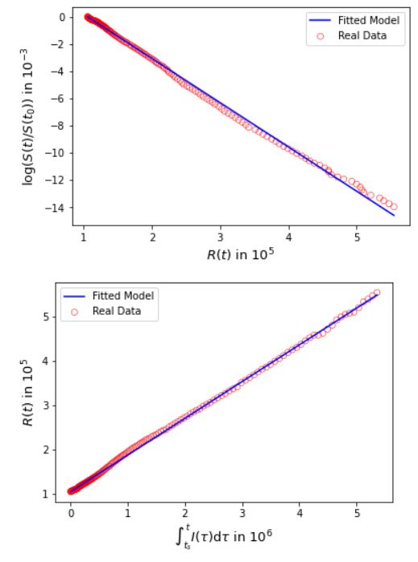

<<<<<<< HEAD
Diff. eq. for 2 populations:

Question: 

    -Simulation (with some randomness) -> if we find literature. + calculation?
    -Literature? -> review papers. stochastic diff. eq. (https://www.tandfonline.com/doi/pdf/10.1080/07362994.2012.684319?needAccess=true). Google scholar: review. 
    -Real data? Took code from internet for first step (Problem?)
    -Weekly journal check? Make own milestones weekly. Get feedback. Not sure if grades. 
=======
Week 0 (18.05-25.05):

In the first week we want to come up with the high level milestones that are to be completed during this project. 

1 Only one region: 

Function that computes the number of susceptible/infected/recovered people as a function of time using the [SIR model](https://scipython.com/book/chapter-8-scipy/additional-examples/the-sir-epidemic-model/). We want to implement different scenarios such as number of people, interactions, ...

2 Several regions:

Simulate several regions that are in contact with each other. Region can be a country or a school etc. depending on the scale of our model.

3 Vaccinations:

Implement the impact of vaccines in the code. Compute the fraction of vaccinated people for erradication of the virus.
>>>>>>> ee720253e1ac5bdaa017dfbaa692616e0b19e30a

=======

Week 1 (25.05-30.05)
Using the SIR model mentioned above, we were able to analyze the spread of a virus over a closed population using [this](https://gitlab.kwant-project.org/computational_physics/projects/Project-3_albertogori_compphys_bot_matteodeluca_pdedalmauhugue/-/blob/master/Skeleton.py#L1-33) set of differential equations to model the change in susceptible (S), infected (I) and recovered (R) people. The parameters that influece the spread of the infection are $`\beta`$ and $`\gamma`$, which define respectively the contact rate of the disease and the mean recovery rate. With these two parameters, we can compute a third one called "basic reproduction factor" $`R_0 = \frac{\beta}{\gamma}`$ which gives an indication of how much the infection will spread. Changing these parameters, we can see how the spread of the virus has different outcomes in the figures below with a sample of 1000 people.

Fig.1: Plot of the pandemic with $`\beta = 0.2`$ and $`\gamma = \frac{1}{15}`$. In just over 100 days, over 90% of the population got the virus, also due to a factor R_0 = 3

Fig.2: Plot of the pandemic with $`\beta = 0.2`$ and $`\gamma = \frac{1}{10}`$. In the same amount of time as in figure 1, less people got infected and the peak, which takes place after the same amount of time, is considerably smaller. This is because a bigger recovery rate means that people heal faster and thus can spread the virus for a shorter amount of time.

Fig.3: Plot of the pandemic with $`\beta = 0.3`$ and $`\gamma = \frac{1}{10}`$. Here, a bigger beta gives rise more quickly to the peak of the infection compared to the first 2 plots and over 90% of the population gets infected in less than 100 days.

Fig.4: Plot of the pandemic with $`\beta = 0.2`$ , $`\gamma = \frac{1}{10}`$ and a population of N=200000. For this plot we used the same parameters as in figure 2, but a much bigger population. We can see that in the end the percentage of the people getting infected is the same, but the peak of the infection happens later, after about 120 days.

After confirming that our code worked, we moved to 2 populations interacting. To do so, we used [this](https://gitlab.kwant-project.org/computational_physics/projects/Project-3_albertogori_compphys_bot_matteodeluca_pdedalmauhugue/-/blob/master/Skeleton.py#L35-83) set of differential equations to include the contact rate between the two different populations. In this case, $`\beta`$ and $`\gamma`$ are 2x2 matrices. The plots below show that the code works as expected and were all computed using $`\gamma = 0.2`$ for both populations.

Fig.5: Plot of the pandemic for 2 populations with $`\beta_{11} = 0.25`$, $`\beta_{12} = 0.10`$, $`\beta_{21} = 0.10`$ and $`\beta_{22} = 0.45`$. Here we can see that the pandemic spreads fast and to the majority of the population, especially in population 2 which has a higher beta. The value of R_0 for the combined population is in fact 2.25.

Fig.6: Plot of the pandemic for 2 populations with $`\beta_{11} = 0.10`$, $`\beta_{12} = 0.10`$, $`\beta_{21} = 0.10`$ and $`\beta_{22} = 0.20`$. This combination of beta and gamma gives a value R_0 = 0.75 and in fact the pandemic has light effects, with no visible peaks.

Fig.7: Plot of the pandemic for 2 populations with $`\beta_{11} = 0.20`$, $`\beta_{12} = 0.50`$, $`\beta_{21} = 0.10`$ and $`\beta_{22} = 0.20`$. This plot was made to show how one population can have an influence on the other. In fact, each has the same value for beta, but population 2 has a big influece on population 1 given by $`\beta_{12} = 0.50`$. As a result, population 1 experiences a much bigger rise in infections.

=======

Week 2 (31.05-06.06)
For this week, we implemented the vaccines for one population following [this paper](https://www.medrxiv.org/content/10.1101/2021.02.05.21250572v2.full.pdf) and we did so [here](https://gitlab.kwant-project.org/computational_physics/projects/Project-3_albertogori_compphys_bot_matteodeluca_pdedalmauhugue/-/blob/master/Skeleton.py#L1-33). In this way, we can modify the efficacy of the vaccine ($`\alpha`$) and the rate at which people are vaccinated (u) to see the different outcomes. Also, we can see how the virus spreads over a population that is already vaccinated in some percentage. 

Fig.8: Plot of the pandemic with $`\beta = 0.2`$ , $`\gamma = \frac{1}{10}`$ and a population of N=200000. This was done using the same parameters as in figure 4 but vaccinating 100 people per day (u = 100) with a vaccine efficacy at 90% (alpha = 0.9). We can see that the peak as well as the total number of infections are reduced.

Fig.9: This plot was obtained using the same parameters as before except for u = 500. This means that after 100 days (which is when the peak happens without vaccines) 1/4 of the population has been vaccinated. Because of this, the peak is much smaller and happens later.

In addition, also following methods of the section 3.2 from the [paper cited above](Literature/Canada_vaccination.pdf), we obtained some values for the basic reproduction number $`R_0`$, the infection rate $`\beta`$ and the removal rate $`\gamma`$. Below is an example for the entire state of Canada between July 17, 2020 and January 8, 2021:

The paper mentions that one can derive the following relations directly from the SIR model:

$`\log\left(\frac{S(t)}{S(t_s)}\right) = -\frac{R_0}{N}\cdot(R(t)-R(t_s))`$

$`R(t) - R(t_s) = \gamma \int_{t_s}^t I(\tau) \mathrm{d}\tau`$

estimating the parameters using linear regression yields:

This study: $`\beta = 0.0827`$, $`R_0 = 1.24`$, $`\gamma = 0.0670`$
Literature: $`\beta = 0.0976`$, $`R_0 = 1.25`$, $`\gamma = 0.0781`$

Fig.10: Plots of the equations above using real data for Canada.

=======

Week 3 (07.06-13.06)

Below are the plots of the model together with the real data. The parameters are those obtained from the linear regression.

Fig.11: Model and data for Canada from July 17, 2020 to January 8, 2021.

Below, we use the model to predict the vaccine's impact. We assume the vaccine begins to be administered.

Fig.12: Infected

Fig.12: Removed

Fig.14: Daily new cases

The data is in reasonable agreement with the [literature](Literature/Canada_vaccination.pdf). The parameters that we obtain are less accurate because we do not use a non-linear program solver to refine the model.
